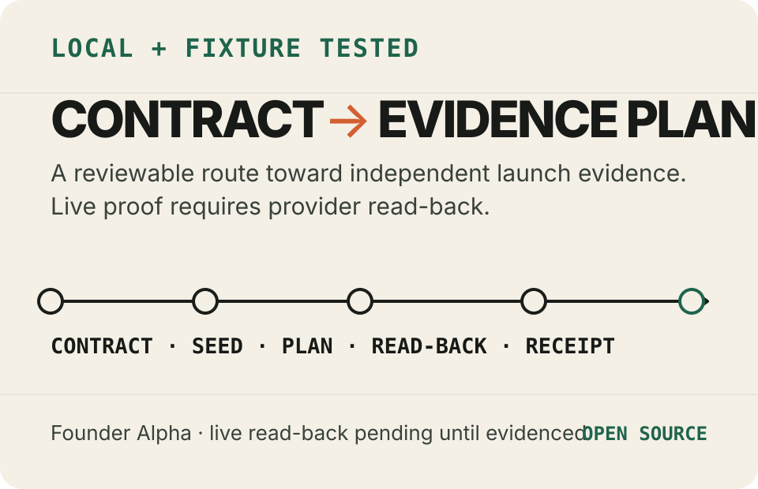

<p align="center">
  
</p>

# Venture Harness

[](https://github.com/meestierolff/venture-harness/actions/workflows/quality.yml?query=branch%3Amain)
[](LICENSE)
[](package.json)
[](package.json)
[](docs/product/FEATURE_STATUS.md)

> **Founder Alpha — local and fixture tested.** The Core path is covered by local
> tests and synthetic provider fixtures. Read [current evidence](#supported-and-experimental)
> before relying on a capability. No live provider or customer result is implied.

**Product objective:** test whether a reviewed Launch Contract can eventually
reach founder-owned provider evidence. Founder alpha currently stops before
product-build model execution.

Venture Harness is an open-source, agent-first SaaS Launch Factory for turning
one reviewed Launch Contract into an independent app seed and bounded launch
plan for the founder's own repository and provider accounts. Founder alpha does
not ship an audited model-execution driver, so rough-prose sharpening and the
two product-build model tasks fail closed before invocation.

[Start the five-minute quickstart →](#five-minute-quickstart)

**Long-term target — not current capability:** carry the complete path from idea
to verified production. Any production proof must be reported separately through
provider read-back and a sanitized Launch Receipt.

## What Venture Harness does

It is designed to answer one question:

> What is the smallest useful online business that can be built, launched,
> verified, and measured from this idea?

The public path has six concepts:

1. **Launch Contract** — one reviewable business and product decision object.
2. **Founder Stack** — credential references and account destinations you own.
3. **Venture Seed** — a focused, standalone starting product, not the final UI.
4. **Launch Grant** — the exact providers, effects, limits, and expiry you approve.
5. **Launch Receipt** — sanitized evidence of what is planned, waiting, fixture-tested, or verified.
6. **Core Upgrade** — managed framework changes that preserve venture-owned product and design files.

Five commands carry that path:

```bash
vh idea sharpen
vh stack connect founder-default
vh launch --dry-run
vh launch --apply
vh upgrade
```

Everything else is implementation detail.

## What the founder-alpha Core adds to a boilerplate

| Evidence level      | Additional founder-alpha object                                               |
| ------------------- | ----------------------------------------------------------------------------- |
| locally tested      | a reviewable Launch Contract and smallest-product boundary                    |
| fixture tested      | standalone app seeds and capability-selected provider plans                   |
| locally tested      | staged quality profiles and a contract-bound primary-journey check            |
| fixture tested      | ownership-aware Core-upgrade preservation for the registered upgrade path     |
| schema and fixtures | a sanitized Launch Receipt that keeps planned, waiting, and verified distinct |

These rows describe test evidence, not a completed live provider launch.

Venture Harness is not a no-code builder, hosted control plane, provider
marketplace, generic AI coding assistant, workflow editor, social network, ad
platform, or long startup-strategy report.

## Intended flow — not live-verified

```text
reviewed Launch Contract
  → capability-scoped build context
  → independent venture repository
  → founder-owned GitHub · Vercel · Neon · Stripe
  → verified provider URL and primary journey
  → Launch Receipt
```

An audited product-build driver is required before repository or provider work
can run through this sequence. The locally tested canonical web graph contains two single-attempt product
tasks: one build and one review/repair. The Launch Grant binds that compiled
count. Founder alpha deliberately has no executable production host for those
tasks; fixture hosts test graph behavior without a model call. Infrastructure
already supplied by Core, the selected seed, or provider adapters is
deterministic work, not model work.

## Five-minute quickstart

Requirements: Git, Node.js `>=22.5`, and `pnpm@9.15.9` through Corepack.

**Scope:** five minutes is the local contract-validation and dry-run orientation
path after those prerequisites are installed. Provider signup, credential
brokering, product work, review, and a verified live launch are separate.

```bash
git clone https://github.com/meestierolff/venture-harness.git
cd venture-harness
corepack enable
pnpm install --frozen-lockfile
pnpm verify:fast
```

Choose a directory outside the Core checkout for independent ventures:

```bash
pnpm vh -- config set ventures-root ~/Projects/ventures
```

Connect the fixed founder Stack. The command inspects official CLI sessions and
stores only `cred://…` references plus non-secret account metadata:

```bash
pnpm vh -- stack connect founder-default
```

Copy the complete synthetic Launch Contract, review every field, then run the
zero-model public flow:

```bash
cp examples/idea-to-launch/launch-contract.yaml ./launch-contract.yaml

pnpm vh -- idea sharpen \
  --input ./launch-contract.yaml \
  --output ./idea.md

pnpm vh -- launch \
  --idea ./idea.md \
  --stack founder-default \
  --production \
  --dry-run \
  --non-interactive \
  --json
```

The dry run creates no provider resource. Inspect its destinations, costs,
effects, and blockers. Retain the exact apply command for a future audited
driver; do not run it in founder alpha. A
verified Vercel production URL satisfies the standard hosting-address
requirement; every selected provider read-back and the contract-bound primary
journey must still pass. Custom DNS may remain an explicit non-blocking action.
The current public apply path will stop before product-build model work because
no audited outer read-isolation driver is installed; do not interpret the
printed apply command as live-launch readiness.

When using an installed CLI instead of this source checkout, replace `pnpm vh
--` with `vh`.

## Copyable founder prompt

```text
Prepare the idea below as one complete Venture Harness Launch Contract and a
zero-effect production dry run.

First write and review one complete Launch Contract: one narrow user, painful job, useful
outcome, core feature, primary journey, price/payment hypothesis, first channel,
success signal, decision rules, capability classifications, and an explicit
not-building list. Keep facts, founder assumptions, model inferences, and
unknowns separate. Do not add generic SaaS infrastructure the contract does not
require.

Then run the zero-model public flow only: validate the Launch Contract with
idea sharpen, run founder-default Stack doctor,
production dry-run, and show me the exact apply command with effects and blockers.
Show the exact apply command, but do not invoke it; founder alpha has no audited
product-build model driver. Never create a real charge, ad spend,
nameserver change, bulk message, destructive migration, or unsupported claim.

Idea: <paste the rough idea here>
```

## Launch Contract example

The Launch Contract is the canonical reviewable input. Locally tested
projections feed the founder brief, launch mode, payment decision, supported
required capability IDs, seed, rendered idea and constitution, and journey
binding. Those projections do not prove commercial correctness or live state.

```yaml
# SYNTHETIC EXAMPLE — NOT LIVE CUSTOMER OR PROVIDER EVIDENCE
schemaVersion: 1
synthetic: true
venture:
  name: Handoff Note
  slug: handoff-note
  targetUser: A solo freelance web developer completing a client website
  painfulJob: Gather scattered access notes and acceptance steps into one handoff
  desiredOutcome: Publish one clear read-only handoff for the client
product:
  oneCoreFeature: A structured handoff checklist that becomes a read-only link
  primaryJourney:
    - Sign in and create one handoff.
    - Complete and preview the client view.
    - Publish and open the read-only link.
business:
  model: subscription
  priceHypothesis: 9
  currency: EUR
  paymentProvider: stripe
decision:
  launchMode: thin_mvp
  primarySuccessSignal: handoff_published
capabilities:
  frontend: REQUIRED
  database: REQUIRED
  authentication: REQUIRED
  payments: REQUIRED
  transactionalEmail: DEFERRED
  agentSurface: NOT_APPLICABLE
```

The abbreviated block shows the decision surface; the [complete synthetic
contract](examples/idea-to-launch/launch-contract.yaml) contains every required
field and is explicitly not customer or provider evidence. An existing valid
`schemaVersion: 1` Launch Contract uses the locally tested zero-model-call path.
Malformed Launch Contract-like YAML or front matter fails closed before any
model call with its schema version, invalid path, problem, expected shape, and
exact remediation. Unambiguously freeform prose is rejected before invocation
until an audited model-execution driver exists.

## Founder-default Stack

The v0.2 Stack is intentionally opinionated:

| Role                 | Default                                          | Standard commerce web launch                   |
| -------------------- | ------------------------------------------------ | ---------------------------------------------- |
| source               | GitHub                                           | blocking                                       |
| deployment           | Vercel                                           | blocking                                       |
| database             | Neon Postgres                                    | blocking when persistence is required          |
| web commerce         | Stripe                                           | blocking when the contract selects payments    |
| native commerce      | RevenueCat                                       | selected only for a compatible mobile contract |
| transactional email  | Brevo                                            | exact non-critical action when unavailable     |
| analytics and search | Google Analytics, Search Console, Bing Webmaster | exact non-critical actions when unavailable    |
| domain and DNS       | founder-owned domain, supported or manual DNS    | custom DNS does not block the Vercel URL       |
| build host           | no audited driver installed                      | fails closed before product model work         |

`vh stack doctor founder-default` is read-only. “Configured,” “accepted,” and
“verified” are distinct states; success requires provider read-back.

## What gets created

```text
~/Projects/venture-harness        ← public Core monorepo
~/Projects/ventures/handoff-note  ← independent venture
    ├── .git and its own private remote
    ├── venture-specific product and design
    ├── database and additive migrations
    ├── deployment and provider configuration
    ├── sanitized Launch Receipt
    └── harness.lock
```

The child has its own lockfile and normal Git history. It remains operable when
Venture Harness is unavailable and does not import the Core checkout at runtime.

## Launch Receipt example

Every launch writes machine-readable JSON and human-readable Markdown. Unknown
counts remain `null`; provider request acceptance never becomes verification.

```json
{
  "venture": { "name": "Handoff Note — SYNTHETIC EXAMPLE" },
  "stack": {
    "github": "planned",
    "vercel": "planned",
    "neon": "planned",
    "commerce": "planned"
  },
  "verification": {
    "deployment": "planned",
    "primaryJourney": "fixture"
  },
  "limitations": ["SYNTHETIC EXAMPLE — NOT LIVE CUSTOMER OR PROVIDER EVIDENCE"]
}
```

See the [complete synthetic idea-to-launch example](examples/idea-to-launch/)
and [fixture receipt](examples/idea-to-launch/launch-receipt.fixture.json). A
Launch Receipt never contains credentials, authorization headers, database
URLs, private provider bodies, customer data, or full private prompts. It is not
uploaded automatically.

## Token benchmark

The controlled benchmark asks whether Venture Harness can reduce model/tool usage
while holding the product and acceptance criteria fixed. No model run or result
exists, so no token, cost, speed, or quality improvement is claimed.

No universal token-saving claim follows from architecture or a fixture. A
publishable comparison must use the same Launch Contract, journey, design bar,
acceptance criteria, model family, and call limits for both paths:

```text
Path A: Venture Harness
Path B: empty isolated repository with no access to Core, seeds, skills, or dogfood source
```

The percentage is published only when both paths pass and accounting is
comparable:

```text
1 - (Venture Harness total tokens / empty-repository total tokens)
```

The first completed result will be labeled **“First controlled dogfood
benchmark. Not yet a universal result.”** Until then, token efficiency is an
objective, not a savings promise. The current [review protocol](docs/engineering/STANDARD_SAAS_TOKEN_BENCHMARK_PROTOCOL.md)
is validation-only and deliberately refuses model execution until real
source-bound dogfood evidence and one immutable held-out evaluator exist.

## Architecture

One public Core monorepo produces ordinary independent venture repositories:

```text
Venture Harness Core
        │  vh launch
        ▼
Independent venture repository
  ├── unique product and design
  ├── own Git history
  ├── own database and deployment
  ├── own commerce and analytics
  └── harness.lock
```

Agents have one root [AGENTS.md](AGENTS.md), one CLI, one Launch Contract, and
one source of launch truth. The build-context manifest selects only relevant
contract, seed, capability, provider, skill, and check files under a bounded
estimate. A normal web SaaS excludes mobile, Winner Loop, Fleet, paid
acquisition, recursive customer tenancy, and unrelated provider documentation.

For implementation detail, see [ARCHITECTURE.md](ARCHITECTURE.md) and the
[provider capability matrix](docs/audits/PROVIDER_CAPABILITY_MATRIX.md). The
[Core public-surface design record](docs/brand/CORE_PUBLIC_SURFACE.md) documents
the visual thesis, responsive composition, contrast, and anti-template choices.

## Supported and experimental

Status words follow [Product Truth](docs/product/PRODUCT_TRUTH.md): local and
fixture evidence is `PROTOTYPE`; `LIVE` requires production read-back.

| Capability                                                                      | Founder Alpha evidence                                      |
| ------------------------------------------------------------------------------- | ----------------------------------------------------------- |
| Launch Contract and fail-closed structured parsing                              | locally tested zero-model prototype                         |
| rough-prose sharpening and product-build model execution                        | unavailable until an audited driver is installed            |
| capability-scoped build context and two-task canonical web plan                 | locally tested prototype; excludes the idea sharpener       |
| ordinary standalone web seed, frozen child install, build, journey, and upgrade | local/fixture-tested prototype                              |
| durable graph, resume, reconciliation, idempotency, and redaction               | locally tested prototype                                    |
| GitHub, Vercel, Neon, Stripe, Brevo, Google, Bing, and DNS adapters             | contract/fixture-tested; live state requires read-back      |
| real founder dogfood and controlled token benchmark                             | not claimed until evidence artifacts exist                  |
| iOS, RevenueCat, EAS, App Store Connect, recursive services, Fleet, Winner Loop | experimental or optional; excluded from a normal web launch |

The detailed matrix is [docs/product/FEATURE_STATUS.md](docs/product/FEATURE_STATUS.md).

## Security, ownership, and no phone home

- Only `cred://…` references belong in repository state. The tested broker,
  scanner, and redaction boundaries reject supported credential shapes from
  durable state and sanitized outputs; official CLI sessions remain explicit
  trust boundaries rather than a universal secrecy guarantee.
- Fixture-tested provider plans target founder-selected accounts; no live
  resource has been created or read back by this template. There is no hosted
  Venture Harness control plane or shared customer infrastructure.
- External effects require a typed run envelope. Deletion, destructive data,
  nameserver replacement, bulk/cold sending, real charges, and irreversible
  publication require distinct authorization.
- Private form, email, name, search, message, and user-content fields stay out
  of analytics and normalized learning datasets.
- Core implements no hosted Venture Harness telemetry endpoint, and v2 Launch
  Receipts have no automatic upload path. Dependency preparation and normal
  installation may contact package registries; authorized model and provider
  tooling may contact their selected endpoints.

See [SECURITY.md](SECURITY.md), the [threat model](docs/security/THREAT_MODEL.md),
and [ownership/offboarding](docs/operations/OFFBOARDING.md).

## Upgrade model

```bash
vh upgrade --dry-run
vh upgrade
```

Every managed file is `core_owned`, `merge_managed`, or `venture_owned`. The dry
run reports ownership before changing anything. Core-owned changes apply only
against a trusted prior hash; overlapping edits stop. Product identity, design,
copy, and business-specific code remain venture-owned. `harness.lock` advances
only after the upgrade and required checks succeed; rerunning the same upgrade
is idempotent.

## Verification

```bash
pnpm verify          # compatibility and invariant checks
pnpm verify:fast     # changed-surface feedback
pnpm verify:mvp      # full deterministic product and Core gate
pnpm verify:release  # package, Golden Path, closure, and public-surface gate
pnpm verify:live     # real provider read-back only; may honestly be INCOMPLETE
```

Before founder-alpha completion, run `pnpm verify:mvp && pnpm verify:release`.
Skipped live checks name the provider, missing prerequisite, exact command, and
expected evidence; a skip is never a pass.

## Open source and contributing

Venture Harness is MIT licensed. Read [CONTRIBUTING.md](CONTRIBUTING.md),
[GOVERNANCE.md](GOVERNANCE.md), [CODE_OF_CONDUCT.md](CODE_OF_CONDUCT.md), the
[roadmap](docs/product/ROADMAP.md), [changelog](CHANGELOG.md), and
[security policy](SECURITY.md).

The public source and issue history live in the
[meestierolff/venture-harness repository](https://github.com/meestierolff/venture-harness),
maintained under the repository-access model in [GOVERNANCE.md](GOVERNANCE.md).
Use GitHub Issues for public project contact and GitHub Security Advisories for
private vulnerability reports. The project is contributor-authored under the
[MIT license](LICENSE); it does not claim a separate company identity.

Canonical agent skills live in `skills/<name>/`; generated `.agents/` and
`.claude/` copies stay in sync through:

```bash
pnpm agents:sync
pnpm agents:check
```

When using a fork, update the clone URL in this README and the security-advisory
URL in `.github/ISSUE_TEMPLATE/config.yml`. Generated ventures resolve the
founder's fork; they do not carry a hidden upstream account dependency.

## Repository preview

The original [GitHub hero](docs/assets/venture-harness-hero.svg) and
[1280×640 social-preview source](docs/assets/venture-harness-social-preview.svg)
use system-safe typography, solid colours, and no stock imagery or invented
metrics. GitHub requires a raster upload; follow the exact
[social-preview upload step](docs/public/GITHUB_SOCIAL_PREVIEW.md).

Venture Harness remains fully usable without TrendsFast, ShipToUsers, Outfast,
or any other ecosystem service. No unverified destination is linked here.
