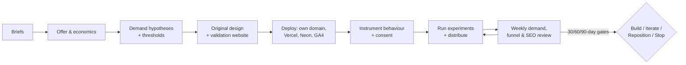

# Venture Harness

**A reusable harness for starting, validating, designing, building, measuring,
and improving new software businesses — with any frontier coding agent.**

AI made software cheap to build. It did not make demand cheap to prove.
Founders now ship polished products before answering the questions that
actually kill companies: who needs this most, is the pain urgent, can the
customer be reached, will they pay, and how fast can acquisition cost be
recovered?

Venture Harness enforces the boring sequence that works:

> **Prove demand before expanding product scope.**

Each venture starts as a repository created from this template. The first
product is a **demand-validation website** on its own domain — not a
decorative pre-launch page, but a measured commercial experiment that runs
for 30–90 days and ends in an explicit **build / iterate / reposition / stop**
decision.

A second principle: **blank canvas visually, not blank infrastructure.**
Every venture looks distinct. Every venture inherits the same operational
discipline — analytics contracts, consent rules, experiment records, quality
gates, and versioned market memory.

---

## Works with your coding agent

The harness is agent-neutral at its core. One canonical rule set
([AGENTS.md](AGENTS.md)), one canonical skill library ([skills/](skills/)),
thin adapters per agent:

| Agent              | Instruction source                                           | Skills location               |
| ------------------ | ------------------------------------------------------------ | ----------------------------- |
| OpenAI Codex       | `AGENTS.md`                                                  | `.agents/skills/` (generated) |
| Claude Code        | `CLAUDE.md` → imports `AGENTS.md`                            | `.claude/skills/` (generated) |
| Gemini CLI         | `GEMINI.md` (thin pointer)                                   | reads `skills/` directly      |
| GitHub Copilot     | `.github/copilot-instructions.md`                            | reads `skills/` directly      |
| Cursor / Windsurf  | `AGENTS.md`                                                  | reads `skills/` directly      |
| Any frontier agent | [docs/agents/GENERIC_AGENT.md](docs/agents/GENERIC_AGENT.md) | reads `skills/` directly      |

Generated skill copies are committed, deterministic, and checked in CI
(`pnpm agents:sync`, `pnpm agents:check`). No build step is needed before an
agent can discover skills.

## Quick start

```bash
# 1. Create a new repository from this template (GitHub: "Use this template")
# 2. Clone it, then:
pnpm install
pnpm verify              # everything should pass on a fresh template

# 3. Describe your venture
#    - fill in inputs/VENTURE_BRIEF.md
#    - fill in inputs/DESIGN_BRIEF.md
pnpm init:venture -- --name "your-venture"

# 4. Open the repo in your coding agent and run the bootstrap skill
#    Claude Code:  /venture-bootstrap
#    Codex/other:  "Use the venture-bootstrap skill in skills/venture-bootstrap/"
#    Ready-made prompts: examples/prompts/
```

The bootstrap skill refuses to write application code until the venture has a
coherent ICP, pain, measurable outcome, offer, pricing hypothesis, thirty-day
cash hypothesis, event taxonomy, consent mode, at least one pricing
experiment, product-truth boundaries, and an active plan. That is the point.

## The operating model (30–90 days)



Every week: `pnpm weekly` aggregates analytics exports, SEO data, and
first-party evidence into `reports/weekly/`, and the `$weekly-learning`
skill proposes **one** conceptual change, backed by cited evidence.

## Three-layer analytics, strict by default

| Layer                              | Default provider               | Holds                                                                          |
| ---------------------------------- | ------------------------------ | ------------------------------------------------------------------------------ |
| 1. Aggregate site analytics        | Vercel Web Analytics           | traffic, routes, referrers, devices                                            |
| 2. Consented behavioural analytics | Google Analytics 4 (opt-in)    | funnels, campaigns, cohorts                                                    |
| 3. First-party commercial evidence | Venture-specific Neon Postgres | assignments, exposures, exact prices shown, qualified submissions, conversions |

Layer 3 is the source of truth for commercial validation. Hard lines,
enforced by scripts and CI: no PII in analytics, no form values, no raw
search text, no keystrokes, no session replay, no GA before consent in
strict mode, exact price shown must equal exact price stored, and
high-intent submissions survive analytics failures. See
[docs/engineering/ANALYTICS.md](docs/engineering/ANALYTICS.md).

## What's in the box

```
AGENTS.md            repository constitution + skill router (the map)
skills/              13 canonical skills: bootstrap, offer, validation,
                     experiments/analytics, design, SEO/AEO, distribution,
                     harness engineering, workflow graphs, knowledge graphs,
                     product truth, quality gate, weekly learning
config/              typed YAML contracts: venture, offer, experiments,
                     analytics, quality, content, distribution (Zod-validated)
docs/                source-of-truth documents: business, product, brand,
                     growth, engineering, agents, decisions, plans, legal
scripts/             ~20 deterministic scripts: sync, parity, validators,
                     verifiers, weekly analysis, memory appenders
app/ components/ lib/  visually neutral Next.js foundation: consent banner,
                     typed event taxonomy, experiment assignment, evidence API
memory/              versioned market memory (outcomes, experiments,
                     corrections, customer language)
evals/               evaluation suites that gate important changes
examples/            synthetic sample venture + agent bootstrap prompts
.github/workflows/   quality, agent parity, public release, weekly analysis
```

## Hard rules the harness enforces

- **Never fabricate** customers, testimonials, results, integrations,
  benchmarks, demand signals, or analytics data. Label everything synthetic.
- **Public claims trace to product truth.** Every capability claim maps to a
  status (LIVE / CONCIERGE / PROTOTYPE / PLANNED / UNDER REVIEW / UNVERIFIED)
  in [docs/product/PRODUCT_TRUTH.md](docs/product/PRODUCT_TRUTH.md).
- **Human approval is required** to send messages, publish content, charge
  customers, deploy to production, or merge self-improvement proposals.
  Agents propose; humans approve.
- **One experimental concept at a time.**
- **Code for plumbing, agents for judgement.** Deterministic transformations
  live in `scripts/`, not in model calls.
- **Corrections become cumulative.** Repeated agent mistakes get promoted
  into docs, tests, lint rules, and evals — not into an ever-growing
  constitution.

## For founders

You do not need to read the engineering docs to use this. Fill in two briefs,
run the bootstrap, and let the harness force the uncomfortable questions
before anything gets built. The weekly report tells you, in plain language,
what the market did and what single change to test next. The 30/60/90-day
gates in [docs/product/VALIDATION.md](docs/product/VALIDATION.md) make the
stop decision explicit instead of endlessly deferred.

## For developers

`pnpm verify` is the single gate: agent parity, skill/doc/link/claim
validation, consent and PII checks, experiment assignment determinism,
pricing-recording checks, typecheck, and tests. CI runs the same gate plus a
production build and raw-HTML crawler checks. See
[ARCHITECTURE.md](ARCHITECTURE.md) and
[docs/engineering/HARNESS_ENGINEERING.md](docs/engineering/HARNESS_ENGINEERING.md).

## FAQ

**Is this a startup?** No. It is a harness. The sample venture in
`examples/` is synthetic and labeled as such.

**Does it deploy anything?** No. It leaves every venture ready to deploy to
its own Vercel project, Neon database, and GA4 property — deliberately
independent per venture.

**Is the consent/analytics setup legal advice?** No. It is a conservative
engineering default plus an inventory for your lawyer. See
[NOTICE.md](NOTICE.md).

**Why so much process for a landing page?** Because the landing page is the
experiment. Unmeasured validation sites produce opinions; this produces
evidence.

## License

MIT — see [LICENSE](LICENSE). Contributions welcome:
[CONTRIBUTING.md](CONTRIBUTING.md).
